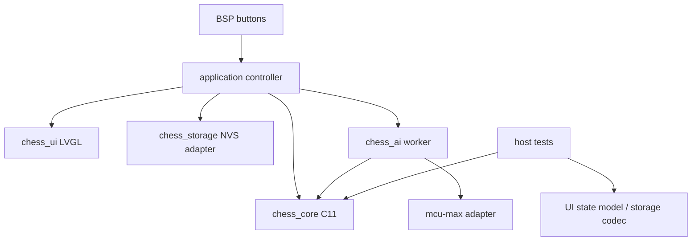

# 架构与任务所有权

## 依赖与模块



| 模块 | 拥有 | 禁止 |
|---|---|---|
| chess_core | 规则、make/unmake、FEN、重复、终局 | LVGL、ESP-IDF、malloc、全局可变单例 |
| chess_app | 唯一真实 game、generation、模式、事件处理 | 同步搜索、锁内 NVS |
| chess_ui_model | 纯 C 选择状态、菜单 reducer | BSP、像素、直接修改 game |
| chess_ui | 一个棋盘绘制对象、header/footer、绘制快照 | 规则副本、全屏缓冲 |
| chess_ai | 请求/取消/结果、引擎私有状态 | 直接修改 game 或 LVGL |
| chess_storage | codec + NVS A/B 槽 | 保存裸 struct、擦除共享 NVS |
| chess_puzzles（后续） | 带来源的局面、答案图、进度 | 把唯一答案等同唯一合法杀法 |

## 部署适配层

棋局程序与安装模型分离。先保持完整固件可独立构建；启动器槽位兼容性验证通过后，才增加 `chess_launcher_adapter`，负责启动握手、返回请求与管理器要求的包格式，不拥有棋局或规则。需分别验证冷启动、启动器启动、游戏内返回与重启返回。多玩法管理器每次启动一个玩法；棋局续玩由本应用 NVS 存档保证。具体安装边界见[部署模型](deployment-model.md)。

## 原始计划目录（当前实现已落地，结构有所演进）

```text
components/chess_core/{include/chess_core.h,chess_position.c,chess_moves.c,chess_game.c,chess_fen.c,CMakeLists.txt}
components/chess_ui_model/{include/chess_ui_model.h,chess_ui_model.c}
components/chess_storage/{include/chess_storage.h,chess_codec.c,chess_nvs.c}
components/chess_ai/{include/chess_ai.h,chess_ai.c,chess_mcumax_adapter.c}
components/bsp/                         # 锁定官方来源，保留 LICENSE
main/{app_main.c,chess_app.c,chess_ui.c,chess_board_draw.c,CMakeLists.txt}
assets/{pieces/,fonts/,SOURCES.md}
tests/host/{CMakeLists.txt,test_core.c,test_ui_model.c,test_codec.c,perft_main.c}
tests/perft/cases.json                  # 已有基准数据，不是测试结果
tools/{test_host.sh,validate_firmware.sh,package_firmware.py}
third_party/mcu-max/                    # M2 导入，锁 SHA + LICENSE + patch 记录
```

原计划中的 core、model、storage、AI、BSP、app、assets 与 host tests 均已实现；当前主要模块目录为 `components/chess_core/`、`components/chess_ui_model/`、`components/chess_storage/`、`components/chess_ai/`、`components/chess_power/`、`main/`、`assets/`、`tests/host/`、`tools/` 和 `third_party/mcu-max/`。上面的树仅用于保留初始设计记录。当前完成度见[开发状态](status.md)。

## 运行模型

- BSP callback 只做非阻塞入队；逻辑事件 `UP_CLICK/DOWN_CLICK/OK_CLICK/OK_LONG`。队列深度目标 16，OK 和取消使用保留控制通道，避免导航洪泛饿死关键事件。
- app task 串行执行 game 转换、焦点 reducer、结果核验；每次新局、落子、载入、退出都递增 64-bit generation。
- LVGL 更新遵循 `bsp_lvgl_lock(timeout_ms)`，仅成功加锁后更新/解锁；绘制回调只访问 UI 快照。不在 LVGL 锁内等待 worker。
- AI 一个 worker，只有它可以调用 mcu-max 全局 API。取消以原子 flag 传递；callback 观察 flag 后调用 stop。退出收到 ACK 才释放 worker 的数据；超时显示错误并阻止重启搜索，不强制删除仍在访问数据的 task。
- storage worker 的待保存请求按最新 generation 合并，但正在写的快照不可变。完成消息注明序号，旧序号 ACK 不把新局显示成“已保存”。AI 搜索与 Flash 写入优先串行，避免初期资源竞争。
- 初始化顺序：NVS（错误不自动全擦）→共享 BSP 总线/显示→LVGL→app/UI→buttons；不启用 radio/audio demo。

## 约定与可观察性

枚举状态与错误码，禁止用字符串推断状态。move 坐标采用 `a1=0, h8=63`，持久化显式字节序。固定容量 API 返回 `BUFFER_TOO_SMALL`，不悄悄截断合法着。

日志包含 commit、IDF、BSP SHA、模式、generation、搜索耗时/降级、保存序号/错误、heap/stack；不记录无关设备身份或网络凭据。测试依赖通过注入 clock、RNG、storage backend、事件队列实现。
